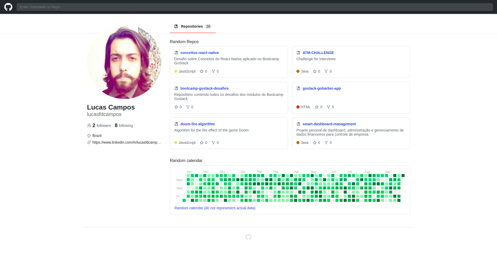
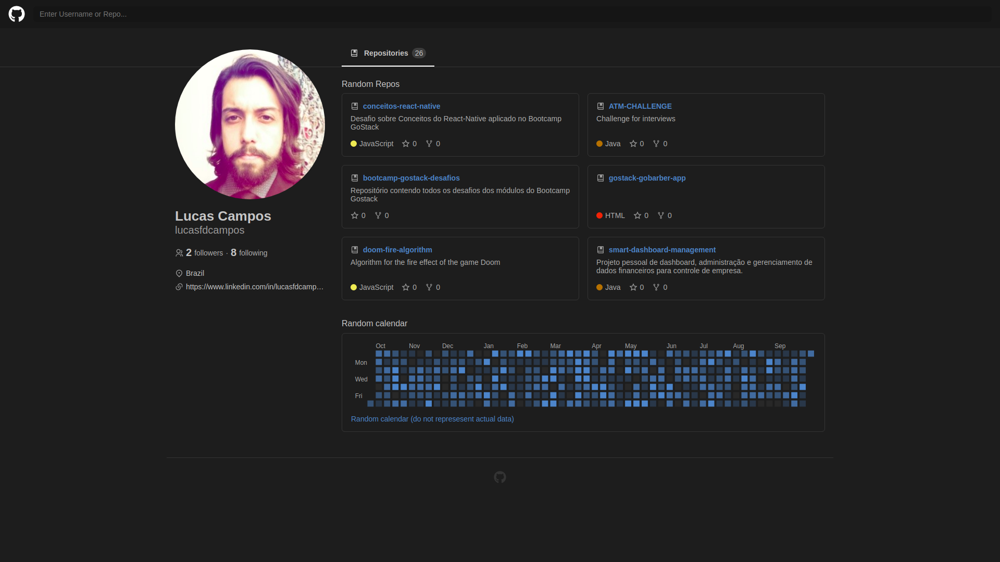

<h1 align="center">
  <br /><br />
  
</h1>

<h3 align="center">
  UI Clone - Clone GitHub interface.
</h3>

<p align="center">
   <a href="https://www.linkedin.com/in/lucasfdcampos/">
    
  </a>
  
  
  <a href="https://github.com/lucasfdcampos/ecoleta/commits/master"></a>
  <a href="https://github.com/lucasfdcampos/ecoleta/issues"></a>
</p>

<p align="center">
  <a href="#pushpin-about">About</a>&nbsp;&nbsp;&nbsp;|&nbsp;&nbsp;&nbsp;
  <a href="#-technologies">Technologies</a>&nbsp;&nbsp;&nbsp;|&nbsp;&nbsp;&nbsp;
  <a href="#computer-layout">Layout</a>&nbsp;&nbsp;&nbsp;|&nbsp;&nbsp;&nbsp;
  <a href="#page_with_curl-how-to-get">How to get</a>&nbsp;&nbsp;&nbsp;|&nbsp;&nbsp;&nbsp;
  <a href="#star-challenges">Challenges</a>
</p>

## :pushpin: About

UI Clone tutorial of the layout (with responsiveness :iphone) of GitHub interface taught by [Guilherme Rodz](https://github.com/guilhermerodz). Video available on the [Rocketseat channel](https://www.youtube.com/channel/UCSfwM5u0Kce6Cce8_S72olg).

## :computer: Layout

### :sunny: Light mode



### :last_quarter_moon_with_face: Dark mode



## :page_with_curl: How to get

_Obs: this is a monorepo about all projects and tutorials of Rocketseat channel. Go to the correct directory._

```bash
$ git clone https://github.com/lucasfdcampos/rocketseat-youtube.git
```

**Access the directory**

```bash
$ cd clone-github
```

**Install dependencies**

```bash
$ yarn
```

**Start**

```bash
$ yarn start
```

## :star: Challenges

- Apply [SWR](https://swr.vercel.app/)
- Connect [API v4 with GraphQL](https://developer.github.com/v4/)

---

<a href="https://github.com/lucasfdcampos">
    
</a>
&nbsp
<a href="https://linkedin.com/in/lucasfdcampos">
  
</a>
